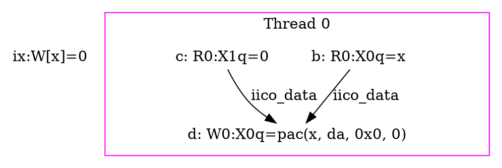
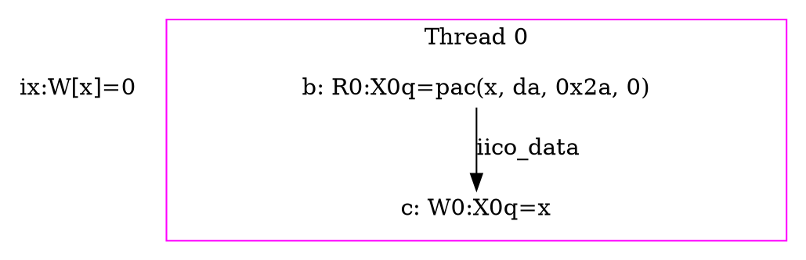
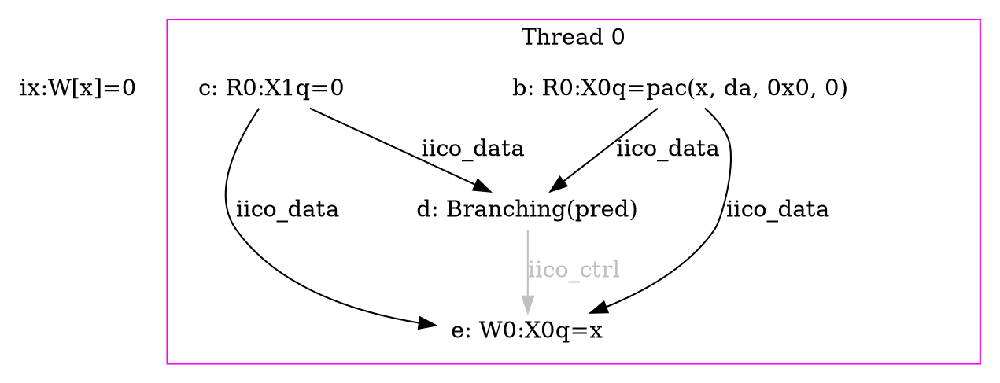
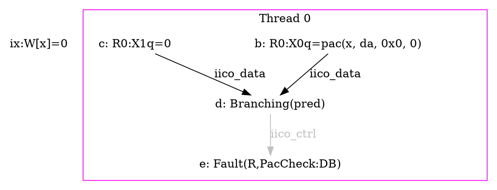
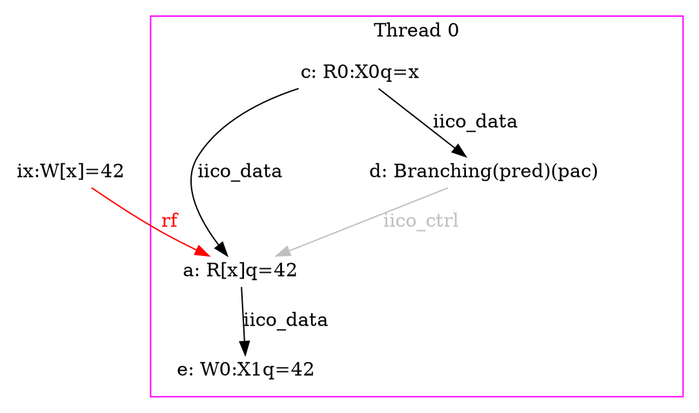
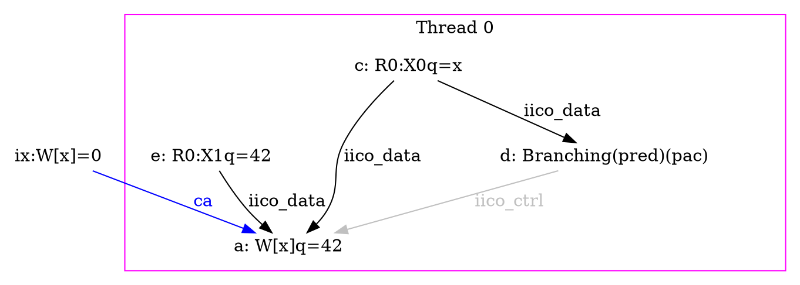
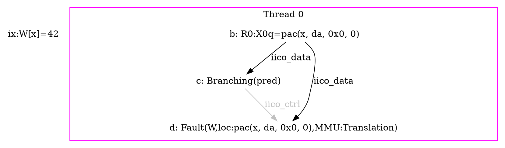

# Pointer Authentication Code

This note focus on Pointer Authentication Code with the different extensions:
- `FEAT_Pauth`: Basic pointer authentication extension
- `FEAT_Pauth2`: Change the way we add an authentication to a pointer
- `FEAT_FPAC`: Allow to generate a fault dirrectly at the autheutiation in case
    of a fail, instead of faulting at memory translation.

## Instructions

Pointer authentication add some new instructions, the new one are
- `pac* x,y` with `*`the correponding authentication key (may be `da`, `db`,
    `ia` or `ib`), and their is some special instruction for diffent specific
    values of `y`, like `pacdza x` for `y=XZR`. This instruction add a pac field
    (a cryptographic signature of `(x, y)` using the given key) in the most
    significant bits of the virtual address `x`. We call `y` the modifier.
- `xpacd x` or `xpaci x`: remove the pac field of the virtual address `x`, in
    abscence of address tagging the two instruction have the same semantic.
- `aut* x, y`: authenticate the pac field of a virtual address using a given
    key, a virtual address `x` and a modifier `y`. If the anthentication is a
    success then this instruction return the initial value of `x` (it remove
    it's pac field), otherwise a fault is generated.

To understand the sequencial behaviour of these instruction we can write the
following simplified table (in abscence of hash collisions):

| x0:         | x                  | pac(x,da,0)        | pac(x,ia,0)        |
|:------------|:-------------------|:-------------------|:-------------------|
| ldr x1,[x0] | `x1 <- mem[x]`     | Fault(Translation) | Fault(Translation) |
| pacdza x0   | pad(x,da,0)        | non deterministic  | non deterministic  |
| autdza x0   | Fault(PacCheck:DA) | x                  | Fault(PacCheck:DA) |
| xpacd x0    | x                  | x                  | x                  |

## Hash collisions

The cryptographic signatures in PAC are small, because they must be in the most
significant bits of a virtual address. As example according to the tests I did
in `KVM-unit-tests`, they are `15` bits (the PAC field is `16` bits long but the
bit `55` is reserved to know the virtual address range of the signed pointer),
so the probability that two random pac fields are equals is `p=1 / 32768`. In
particular this means that this litmus test:

```asm
AArch64 Collisions in loads
{ 0:x0=pac(x, da, 0) }
P0              ;
  ldr x1, [x0]  ;
exists ( ~Fault(P0, MMU:Translation) )
```

will succeed with a probability `p`, and this test too:

```asm
AArch64 Collisions in aut*
{ 0:x0=pac(x, da, 0) }
P0          ;
  autdzb x0 ;
exists ( ~Fault(P0, PacCheck:DB) )
```

It's important to note that the number of bits of the pac field depend of the
context of execution and in particular the size of the virtual addresses, in
another context the pac field may be `8` or `31` bits...

But their is also some collisions in the final state:

```asm
AArch64 Collisions with the final state
{ 0:x0=pac(x, da, 0) }
P0    ;
  nop ;
exists ( 0:x0=pac(x, da, 42) )
```

and

```asm
AArch64 Collisions with the final state 2
{ 0:x0=pac(x, da, 0) }
P0    ;
  nop ;
exists ( 0:x0=x )
```

may succeed with a probability `p`.


The difficulty here is that the set of collisions we found must be coherent, as
example:

```asm
AArch64 Incoherent collisions (aut*)
{
    0:x0=pac(x, da, 0);
    0:x1=pac(x, db, 0)
}
P0          ;
  autdzb x0 ;
exists ( 0:x1=pac(x, da, 0) /\ Fault(P0, PacCheck:DB) )
```

and

```asm
AArch64 Incoherent collisions (final state)
{
    0:x0=pac(x, da, 0);
    0:x1=pac(x, db, 0)
}
P0    ;
  nop ;
exists ( 0:x0=pac(x, db, 0) /\ ~(0:x1=pac(x, da, 0)) )
```

and

```asm
AArch64 Incoherent collisions (cmp and autdzb)
{
    0:x0=pac(x, da, 0);
    0:x1=pac(x, db, 0)
}
P0            ;
  cmp x0, x1  ;
  b.eq finish ;
  autdzb x0   ;
  mov x2,#1   ;
finish:       ;
exists ( 0:x2=1 )
```

will never succeed because at two different points they require that a same
collision (`pac(x, da, 0) = pac(x, db, 0)`) is observed and not observed in the
same execution.

## Memory ordering

Pointer signature and authentication may add new ordering dependencies in the
memory model, in particular data dependency because the output of `pac*`, `aut*`
and `xpac*` depend syntacticly of their inputs. But also control dependencies
because `aut*` may fail and memory operation may fail if the virtual address
they use as input is not canonical.


### `pac*` instruction:

The `pac*` instruction must add two register read data dependencies, in
particular it will read two register and use their value to write the output
value `pacda(x, da, 0x0)` in the destination register (`x0` in this example).

In herd7, as I doesn't emulate `FEAT_CONSTPACFIELD` to reproduce the semantic
of the Apple M3, calling `pac*` to a non canonical pointer (with a pac field
different to `0...0` or `1...1`) raise an user error because the result si
non-deterministic (it may forget the virtual address range of the original
pointer).

So here is an example of litmus test with the pacda instruction:

```asm
AArch64 example.litmus
{
  0:x0=x;
}
P0               ;
  pacda x0,x1      ;
exists
(0:x0=pac(x, da, 0))
```

And here is the expected event graph:



### `xpac*` instruction:

The `xpacd` and `xpaci` instructions take a register and clear it's PAC field
(set it to `0...0` or `1...1` pepending of the bit 55 of the virtual address).
So it add a data dependency between the input event and the output event.

So here is a litmus test with the `xpacd` instruction:

```asm
AArch64 example.litmus
{ 0:x0=pac(x, da, 42) }
P0         ;
  xpacd x0 ;
exists
( 0:x0=x )
```

and here is the expected event graph:



### `aut*`instruction:

In presence of `FEAT_FPAC`, the `aut*` instruction is different to the `pacd*`
instruction because it can raise a fault, so it add some `iico_ctrl`
dependencies, and the presence of data dependencies depend of the success of the
operation because the fault handling doesn't dirrectly use the output register
of `aut*` but only set the error code and add to the `esr_el1` register the
the key (`ia`, `da`, `ib`, or `db`) that generate the fail.

Here is a litmus test with `aut*` that must succede:

```asm
AArch64 autda success
{ 0:x0=pac(x, da, 0) }
P0            ;
  autda x0,x1 ;
exists
( 0:x0=x /\ ~Fault(P0) )
```

and the expected event graph:



And here is a litmut test that may fail (in abscence of a hash collision):

```asm
AArch64 autda success
{ 0:x0=pac(x, da, 0) }
P0            ;
  autdb x0,x1 ;
exists
( 0:x0=pac(x, da, 0) /\ Fault(P0, PacCheck:DB) )
```

and the expected event graph:



***Observation:*** If my understanting of PAC is correct, the write event in
the register `x0` has a data dependency in the read event in the register `x1`
in the success case. Even if the value we write in `x0` doesn't semantically
depend of the value of `x1` (the value is `x` in case of success that doesn't
depend of the modifier, and nothing is write in case of failure). This is
because according to the Arm ARM the output value in `x0` contains in it's most
significant bits the exclusive `OR` of the pac field of `x0` and the pac field
of `ComputePAC(x, X[1, 64])`, so the output has a syntactic dependency even if
the ASL code raise a fault if this pac field is not equal to a constant 7 lines
after this EOR.

### `ldr` instruction:

Load instruction, in case we use virtual addresses, may have some additional
dependencies to check that the virtual address is canonical. These dependencies
are present also without Pointer Authentication, but PAC allow to generate non
canonical pointers. To do this we must add a branching exent at each load that
depend of the input address, and an intrinsic control dependency between this
event and the load event each times we see an `ldr` instruction.

Here is an example of `ldr` success:

```asm
AArch64 load success
{ 0:x0=x; int x = 42; }
P0;
  ldr x1,[x0];
exists
( 0:x1=42 /\ ~Fault(P0) )
```

and here is it's expected event graph:



And here is an example of `ldr` failure:

```asm
AArch64 load failure
{ 0:x0=pac(x, da, 0); int x = 42; }
P0;
  ldr x1,[x0];
exists
( 0:x1=0 /\ Fault(P0,MMU:Translation) )
```

and here is it's expected event graph:


### `str` instruction:

Like the load instruction, the `str` instruction may fail because of an address
translation failure.

Here an example of litmus test to illustrate a `str` success:

```asm
AArch64 str success
{ 0:x0=x; 0:x1=42 }
P0;
  str x1,[x0];
exists
( [x]=42 /\ ~Fault(P0) )
```

and here is it's expected event graph:



And here is an example of a `str` failure:

```asm
AArch64 str failure
{ 0:x0=pac(x, da, 0); int x = 42 }
P0;
  str x1,[x0];
exists
( [x]=42 /\ Fault(P0, MMU:Translation) )
```

and here is it's associated event graph:


