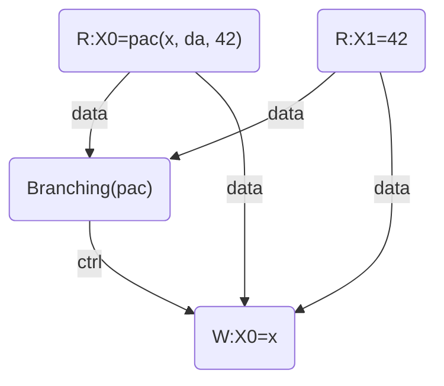
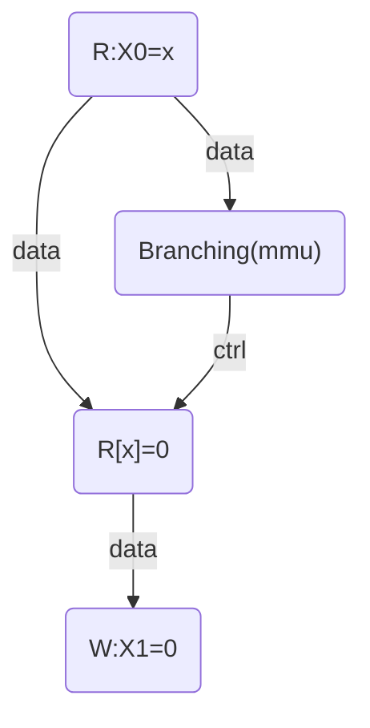
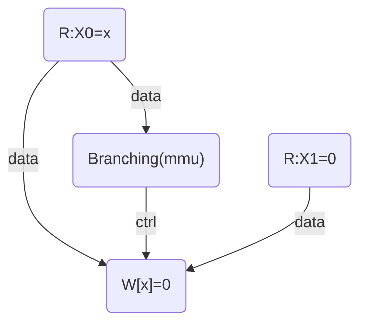

# Pointer Authentication and Weak Memory Models

This note describe the memory model of the PAC instructions, and the relation
between PAC instructions and the dependency in the memory model. Also this note
focus on `FEAT_Pauth2`.

Pointer Authentication or PAC add three basic instructions: `pac* x, y`, `aut*
x, y` and `xpac x`, and adding PAC in herd7 can also introduce some changes in
the memory dependency of memory operations like loads and stores.


First each instructions of PAC add data dependcies between the inputs and the
outputs of the instructions. As example the program

```asm
(1) ldr x0,[x2]
(2) ldr x1,[x3]
    autda x0, x1
(3) ldr x4,[x0]
```

contain a data dependency between the event (1), (2) and the event (3) because
of the `autda` instruction, and the dependency graph is (at least) the following:


But this data dependency is not the only one.
In particular `aut*` may fail if `FEAT_FPAC` is present, and each memory operation
may fail if the PAC field of the address is not canonical (all ones or all
zeros), this implies that each check may add new events and new relations, in
particular control dependencies.

Here is the example of the instruction `autda x0, x1`, if I understand correctly
the events generated by this instruciton and their dependencies must be the
following:



And in particular the output depend of `x0` and `x1` even if `x1` is not
necessary to compute the output in case of success and that the instruction
fault in case of failure. Because according to the documentation the output PAC
field must be the exclusive OR of `x0` and the hash of `x0` with the key `da`
and the modifier `x1` so their is a syntactic dependency in `x1`.

Also the loads and stores from virtual address must have the same control
dependency because they have to check that the virtual address is valid and
raise a fault if this is not the case, as example for `ldr x1,[x0]`:




And for `str x1, [x0]`:




And this added branch may change the memory ordering because of
"dependency-observed-before" contain the relation "ctrl; [W]", so in the
following programs:

```asm
(1) ldr x1, [x0]
    str x2, [x1]
(2) str x3, [x4]
```

and

```asm
(1) ldr x1, [x0]
    autdza x1
(2) str x3, [x4]
```

the read event (1) must be locally ordered before the write event (2) because
of this control dependency.
